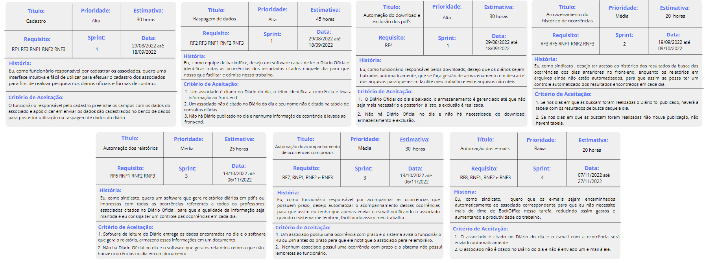
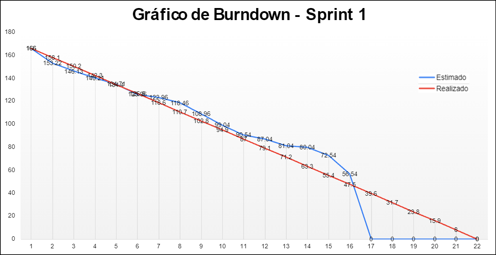
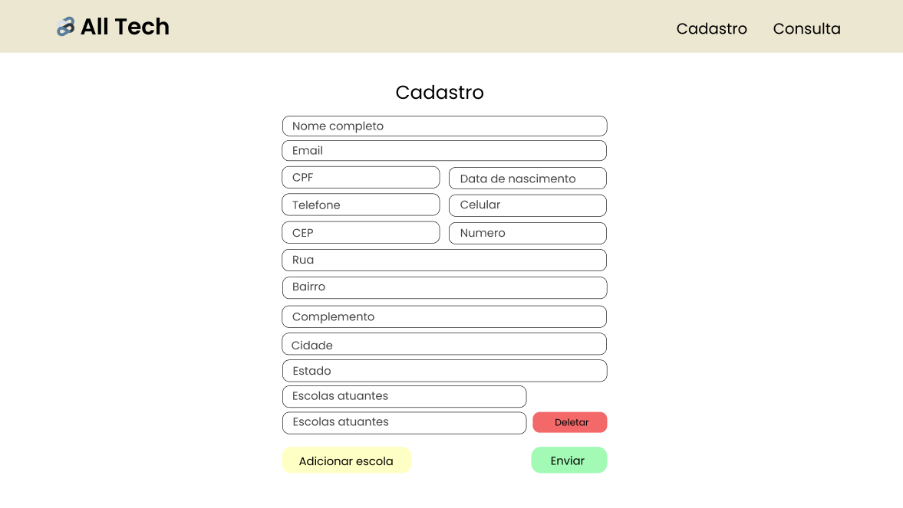
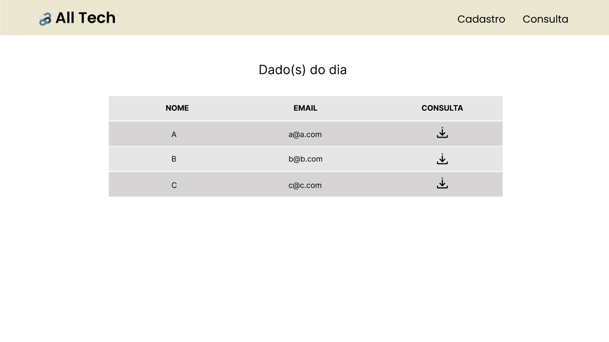
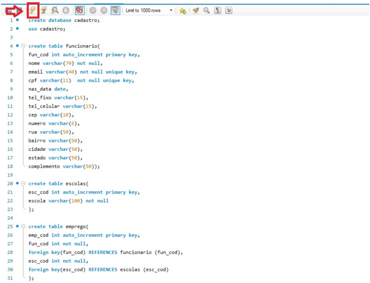
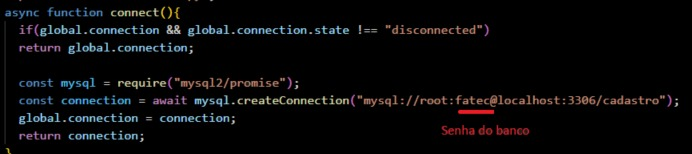
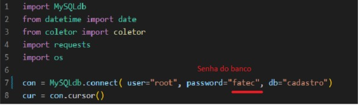

<h3 align="center"> Desenvolvimento de Aplicação Web Simples, FrontEnd Básico, com Persistência em BD Relacional </h3>

    <a href="#sobre">Sobre</a> | 
    <a href="#backlog">Backlogs</a> | 
    <a href="#userstories">User Story</a> | 
    <a href="#burndown">Burndown</a> |
    <a href="#mockup">Mockup</a> |
    <a href="#pastas">Configuração das pastas</a> | 
    <a href="#manual">Manual de usuário</a> |
    <a href="#equipe">Equipe</a>

 

## :pencil: Sobre o projeto
 O projeto tem como objetivo criar um robô automatizado que faz a leitura, identifica e busca o conteúdo do Diário Oficial do Estado de SP relacionado aos Professores Associados, emitindo o relatório diário.
    

> :gear: **Tecnologias Utilizadas:** [ReactJs](https://pt-br.reactjs.org/), [JavaScript](https://developer.mozilla.org/pt-BR/docs/Web/JavaScript), [TypeScript](https://www.typescriptlang.org/), [Node](https://nodejs.org/en/about/), [Python](https://www.python.org/), [HTML](https://developer.mozilla.org/pt-BR/docs/Web/HTML), [CSS](https://developer.mozilla.org/pt-BR/docs/Web/CSS), [Figma](http://www.figma.com), [Visual Studio Code](https://code.visualstudio.com/), [Discord](https://discord.com/), [GitHub](https://github.com/), [Excel](https://www.microsoft.com/pt-br/microsoft-365/free-office-online-for-the-web)

 

   

 ## :pushpin: Backlog do Produto  

 #### Épicos (Requisitos Funcionais) 
| SPRINT | CÓDIGO | DESCRIÇÃO                                                    | STATUS |
|:---------:|--------|--------|:------:|
| 1      | RF1    | Cadastro dos associados                                     |   ✅    |
| 1      | RF2    | Raspagem de dados (leitor)                                   |   ✅    |
| 1     | RF3 | Consultas de dados |   ✅    |
| 1      | RF4    | Automação do download e da exclusão dos pdf's |   ✅    |
| 2      | RF5    | Armazenamento do histórico de consultas no front-end         |   ❌    |
| 3      | RF6    | Automação da montagem do relatório diário sobre os associados citados no Diário Oficial |   ❌    |
| 3      | RF7    | Automação do acompanhamento de citação com prazos            |   ❌    |
| 4      | RF8    | Automação do envio de e-mails                                |   ❌    |

#### Requisitos Não Funcionais  
| CÓDIGO | DESCRIÇÃO | STATUS |
|:------:|:------:|:------:|
| RNF1 | Linguagem Node.js | ✅ |
| RNF2 | Programação em TypeScript e JavaScript | ✅ |
| RNF3 | Banco de Dados Relacional (MySQL) | ✅ |
| RNF4 | Documentações do Projeto | ✅ |
| RNF5   |             Responsividade             |   ❌    |

<a href="#menu">Voltar ao menu</a>

  

 ## :dart: User Stories  

 
 

 

<a href="#menu">Voltar ao menu</a>

 

## :chart_with_downwards_trend: Burndown

 
 

 

  

## :desktop_computer: Mockup

#### Tela de cadastro

    

#### Tela de consulta

<a href="#menu">Voltar ao menu</a>

## :file_folder: Configuração das pastas
* 📂 `script`: Pasta com os códigos do react/front;
* 📂 `doc`: Pasta com Documentação do Banco de Dados e fotos;
* 📂 `server`: Pasta com os códigos bara conexão com o banco e consulta do diário oficial;
* 📂 `PDF`: Pata onde são armazenados os PDFs baixados;
  

 

 ## :scroll: Manual de usuário

* É necessário ter o Node.js, MySQL, Python(versão 3.10),  Visual Studio Code e o Git instalado na máquina.

* Caso não tenha-os, instale pelo https://nodejs.org/en/, https://dev.mysql.com, https://www.python.org/downloads/, https://code.visualstudio.com/Download e https://git-scm.com/downloads

* Crie uma pasta de sua preferência em sua máquina;

* Abra o cmd e digite: git clone https://github.com/All-Tech-DSM/API-2.git

* Feche o cmd;

* Abra o MySQL e execute o arquivo `script.sql` ;

  

* Vá à pasta 📂 `API-2`;

* Abra a pasta no VS Code;

* Em seguida acesse a pasta 📂 server e abra o arquivo `index.js`;

* Vá na linha 06 e configure a rota de seu MySQL;

  

* Em seguida salve o arquivo e feche-o;

* Abre o arquivo “buscador.py” e configure os dados do MySQL na linha 7;

  

* Ainda na pasta 📂 `server` abra o cmd e digite: npm install;

* Em seguida, digite o comando pip install -r req.txt;

* Após a instalação, digite: node index.js;

* Abra um novo terminal e volte para 📂 `API-2`;

* Em seguida vá à pasta 📂 `script`;

* Abra o cmd ;

* Digite: npm install 

* Em seguida, digite: npm start

* A página já estará estanciada em sua localhost.

* Caso o usuário cadastre um novo funcionario, após o cadastro será necessário:

* Ir na pasta 📂 `server`, abrir o cmd e dar ctrl + C, para derrubar o servidor;

* Em seguida, digite: node index.js para ver o resultado da consulta do Diário ;
  

<a href="#menu">--> voltar ao menu</a>
    

 

## :busts_in_silhouette: Equipe

|    Função     |    Nome    |    LinkedIn & GitHub    |
| :-----------: | :--------- | :---------------------: |
| Product Owner | Bruno Henrique Menezes Ramos           |                 |
| Scrum Master  | Amanda Vieira de Oliveira              |                 |
|   Dev Team    | Andressa Ginevro de Souza              |                 |
|   Dev Team    | Carlos Eduardo Falandes                |                  |
 |   Dev Team    | Gustavo Borges Lima                   |                 |
 |   Dev Team    | Júlia Sousa Gayotto                   |                 |
 |   Dev Team    | Lucas França Registro                 |                 |

<a href="#menu">Voltar ao menu</a>
