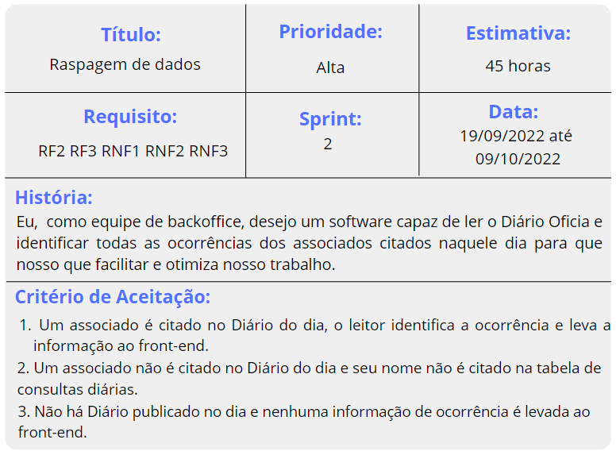
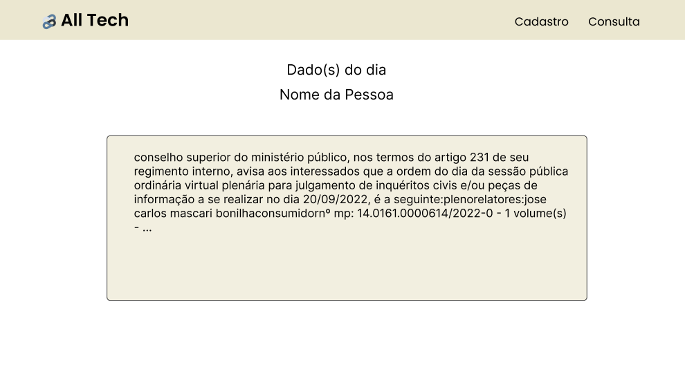
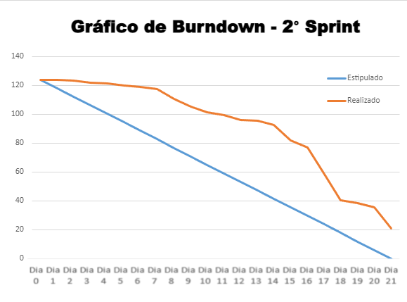

<h3 align="center"> Desenvolvimento de Aplicação Web Simples, FrontEnd Básico, com Persistência em BD Relacional </h3>

 
    <a href="#userstory">User Story</a> | 
    <a href="#mockup">Mockup</a> |
    <a href="#exe">Execução</a> |
    <a href="#burndown">Burndown</a> |
    <a href="#manual">Manual</a>

 

<h4 align="center"> Durante essa segunda sprint o foco foi a raspagem de trechos e o desenvolvimento de melhorias e correções para o projeto. </h4>

  

## :dart: User Story 

 

 

O User Story faz referência aos requisitos: RF2 RF3 RNF1 RNF2 RNF3. 
Confira abaixo a descrição de cada um.

* RF2: Raspagem de dados (leitor)
* RF3: Consultas de dados
* RNF1	Linguagem Node.js
* RNF2	Programação em TypeScript e JavaScript
* RNF3	Banco de Dados Relacional (MySQL)

 

## :desktop_computer: Mockup

Como parte do planejamento do projeto foi criado o mockup para idealização do layout, foi validado pelo cliente para assim ser aplicado na interface.

 

<a href="#menu"> -> Voltar ao menu</a>

 

## :film_strip: Execução

gif aqui

## :chart_with_downwards_trend: Burndown

Para acompanhar as atividades, foi criado e atualizado pelo Scrum Master, um gráfico de burndown onde podemos visualizar de forma tangivel os esforços de tempo e a progressão ao longo dos dias da sprint.

 

 

<a href="#menu"> -> Voltar ao menu</a>
 

 ## :scroll: Manual - Como Rodar

* É necessário ter o Node.js, MySQL, Python(versão 3.10),  Visual Studio Code e o Git instalado na máquina.

* Caso não tenha-os, instale pelo https://nodejs.org/en/, https://dev.mysql.com, https://www.python.org/downloads/, https://code.visualstudio.com/Download e https://git-scm.com/downloads

* Crie uma pasta de sua preferência em sua máquina;

* Abra o cmd e digite: git clone https://github.com/All-Tech-DSM/API-2.git

* Feche o cmd;

* Abra o MySQL e execute o arquivo `script.sql` 

* Vá à pasta 📂 `API-2`;

* Abra a pasta no VS Code;

* Em seguida acesse a pasta 📂 server e abra o arquivo `index.js`;

* Vá na linha 06 e configure a rota de seu MySQL;

* Em seguida salve o arquivo e feche-o;

* Abre o arquivo “buscador.py” e configure os dados do MySQL na linha 7;

* Ainda na pasta 📂 `server` abra o cmd e digite: npm install;

* Em seguida, digite o comando pip install -r req.txt;

* Após a instalação, digite: node index.js;

* Crie outro terminal e entre na pasta 📂 `server`:

* Digite: python app.py;

* Abra um novo terminal e volte para 📂 `API-2`;

* Em seguida vá à pasta 📂 `script`, abra o cmd;

* Digite: npm install;

* Em seguida, digite: npm start;

* A página já estará estanciada em sua localhost.
  

<a href="#menu"> -> Voltar ao menu</a>
